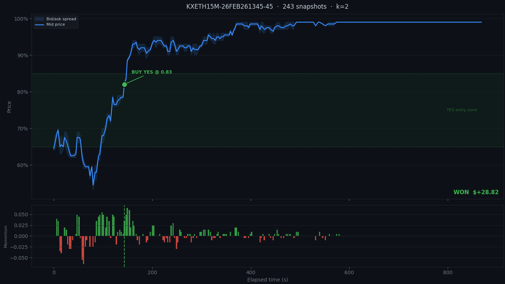
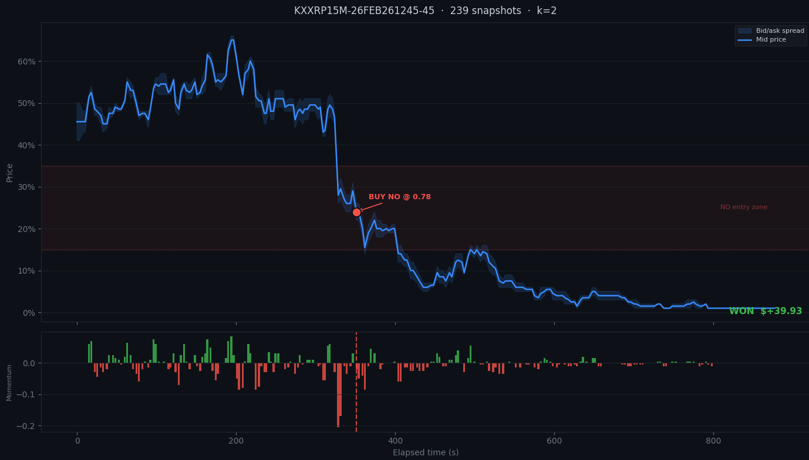

# Prediction Market Trading Bot

https://github.com/rnop/prediction_market_trading_bot/tree/main

### Files (Obfuscated)
- `main.py`: Collects data from Kalshi and Binance combined into a single database
- `backtest.py`: Backtests the strategy
- `live_bot.py`: Runs the live trading bot

### Current Operations
- Live trading bot is running 24/7 on a Digital Ocean droplet monitored by OpenClaw for dynamic adjustments to kelly sizing, asset selection, and identifying market regimes.
- Continue collecting market data for more rigorous backtesting (walk through validation and monte carlo simulation) and strategy improvement.

### Example Trades

